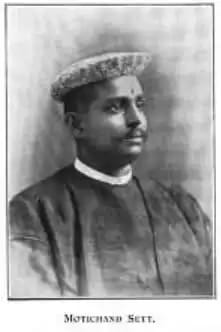
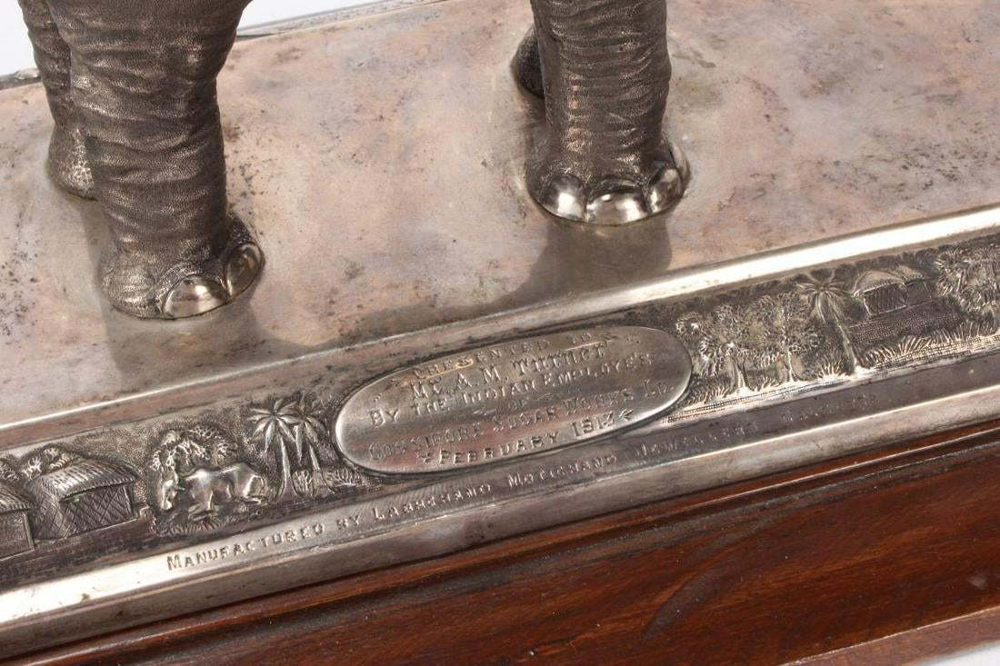

I am not a full Bengali by lineage. My mother, who was born and brought
up in Kolkata, studied in a Bengali medium school and Presidency
college, and became a professor in a renowned college in North Kolkata,
was the daughter of a Parekh family hailing from Bikaner. Her pedigree
is that of a Marwari and Jain business community. She is a Bengali by
heart and soul, and got married to my father from a Dutta family against
all odds, overcoming reservations of both families. My kin on the side
of my mother's father were however strictly Marwaris and Jains and
practised all customs and rituals with vigour. I was clearly an outcaste
among them. I was not very curious about my forefathers and earlier
generations, until my husband who is particularly interested in
researching family trees started digging for more information. I
remember that at night, after dinner he would catch my mother and pester
her to get information to complete the family tree. As I used to lie on
the divan listening to their conversations, names such as Bhim Singh
Parekh would pop up leaving me perplexed!

I knew even less about my mother's maternal family, as she was also
less informed about the history of her maternal lineage. There was no
particular story to tell until we recently stumbled upon a few facts and
stories which left us awestruck, amused and smiling. For me,
particularly, it was eye opening to learn how progressive the Kolkata
based Marwari business community could be in terms of their contribution
to people and society.

My mother's mother Leela married Bhim Singh Parekh at the age of 12,
and was the daughter of one Motichand Nakhat. Motichand was the son of
Lala Phool Chand, who according to "The Cyclopedia of India:
Biographical, Historical, Administrative, Commercial -
[https://archive.org/details/dli.csl.5417/page/n365/mode/2up](Volume
2) (1908)", was "Mookim and Court Jeweller, a famous and honest
jeweller in Bengal, and one of the most influential members of the
Jain Community of the time."

Motichand partnered with Sett Labhchand to establish the jewellery firm
of Messrs. Labhchand and Motichand, based at the "Marble House" at 41,
Dhurrumtollah Street, which in addition to being a showroom, was custom
built to also house a factory with modern equipments, employing 250 to
300 hands in jewellery making. It is also documented that because of the
high skill, quality and excellence of their jewellery they had gained a
wide reputation as a new firm and became very successful.They also
started a free Technical School with the object of teaching the "better
class of the Indian people the art of manufacturing jewellery suited to
modern requirements in the European and Indian styles. This was
practically a necessity to the business as the men who professed the art
as a caste profession and were the traditional producers carrying on the
craft for generations, were unreliable in the extreme, and the firm had
experienced considerable inconvenience owing to the delays occasioned by
their irregular attendance."

<figure class="float-right">
   
   <figcaption>Motichand Nakhat</figcaption>
</figure>

Being a development sector professional, and having worked in the
sectors of livelihood, skills, and crafts, I specifically understand how
progressive and advanced this thought of opening a free technical
institute of excellence was. What is even more impressive is that this
Technical School did not confine its instruction entirely to the
jeweller's art, though it was the main objective. The curriculum
included English literature, Sanskrit, Hindi and Bengali. It was open to
all Jains and Hindu youths, and certain provisions were also made for
boarding and lodging. The firm also apparently made a very prominent
stall at an industrial exhibition in Kolkata (1906-7), where they
exhibited the actual process of diamond cutting, showcasing the skills
and craftsmanship of Indian artisans in practice. This generated much
interest among national and international visitors at the stall. Looking
at our current policies and programmes of Make in India, Skill India and
efforts towards building cultural entrepreneurship, I wonder at how much
of these ideas were already laid out successfully in our artisan and
handicrafts industries in the past.

<figure>
	
	<figcaption>Close-up of an silver elephant figurine by by Labhchand Motichand</figcaption>
</figure>

Motichand Nakhat also established, in memory of his father Phoolchand,
at a cost of around 60,000 rupees, a "large Dharmsala or traveller's
house at No. 9, Shama Bai's Lane, Bara Bazar" that was "quite up to
modern requirements in ventilation and sanitation." In our current state
of adminstration, governance and politics, it seems that we are still
grappling with the same issues that our social reformers and business
communities had actually faced and tried to address more than a century
ago. I have myself believed that entrepreneurs with social sensitivity
from any field are the greatest changemakers and contributors in
society, and my belief and admiration became more strongly rooted on
learning all this. 

This history is indeed very interesting, but what made us search out
all this information from old documents in the first place is even
more exciting, and especially impactful for a Bengali having this
particular Marwari family lineage!

In 1899, Rabindranath Tagore was trying to run the family business
Tagore & Co. in partnership with his nephew Balendranath. The
activities of this business are summarised in the excellent timeline
of Rabindranath's life available online at Rabi Tirtha's website. From
there, we learn that Rabindranath wrote in a letter to Basanta Kumar
Gupta on 12th March 1899 that the company had suffered considerable
losses in its Barishal operations due to the incompetence and possible
dishonesty of its overseer Nishikanta. To make matters worse,
Balendranath, who was suffering from tuberculosis, passed away in
August, leaving Rabindranath solely responsible for the liabilities of
the company. Rabindranath had already asked his friend Priyanath Sen
to secure a loan of 40,000 rupees to keep the company
afloat. Apparently, this loan was finally secured around the 25th of
august, at the rate of 7% interest. And the provider of the loan was
none other than my mother's grandfather Motichand Nakhat! We learn
more about this loan from Rabindranath's [letter to Priyanath
Sen](resources/motichand-nakhat/chithipotro-8-18991117-priyonath-ghosh.jpg)
on 17 November 1899 ([Chithipatra, volume
8](https://bn.wikisource.org/wiki/পাতা:চিঠিপত্র_(অষ্টম_খণ্ড)-রবীন্দ্রনাথ_ঠাকুর.pdf/১০৩),
letter number 93), where he quotes a letter he has received from
attorney Amarnath Ghosh, which read as follows:

> The document in favour of my client Babu Moti Chand Nakhat requires
> registration: as three months have expired, the document must at
> once be registered or a fresh one executed so that you will have 4
> months within which the 2nd document may be registered. An early
> reply will oblige.

Rabindranath is understandably confused and concerned about
such a legal notice. He goes on to express his uncertainty and dismay
about this notice and what trouble such a "party" (loan provider)
could cause him if he is unable to pay back the loan within the allotted
time of one year, and beseeches Priyanath to find him a way out.

According to Rabi Tirtha, this loan was eventually repaid by taking
another loan from Sir Taraknath Palit, presumably on better terms, which
was then repaid using money from Rabindranath's Nobel prize several
years later!

For us, this remains a story book tale that we are happy narrating!

