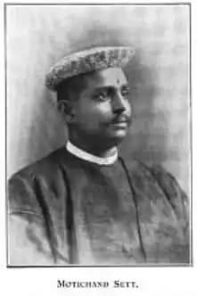

Cyclopedia of India, Volume II

https://archive.org/details/in.ernet.dli.2015.236402/page/n371

The caption "Motichand Sett" for the photo on page 345 has been
"corrected" in the errata given in the next volume to read "Motichand
Nakhat". The grayscale version of the image below was originally from
(but is no longer available at)
<https://www.925-1000.com/forum/viewtopic.php?t=28477>

Images of the silver elephant are from 

<https://www.liveauctioneers.com/item/76563473_rare-indian-colonial-silver-elephant-and-rider>

Lot 0192 Details:

DESCRIPTION

by Labhchand Motichand, Jewellers, Calcutta, depicting a standing
elephant in regalia, with rider and seat, on rectangular base, with
frieze of landscapes and animals, on wooden stand, l 31cm

Moti Chand Nakhat was a delegate at the twelfth session of the Indian
National Congress, Calcutta, December 28--31, 1896

<https://archive.org/details/in.ernet.dli.2015.462077/page/n129>

(second last line, page 131)

